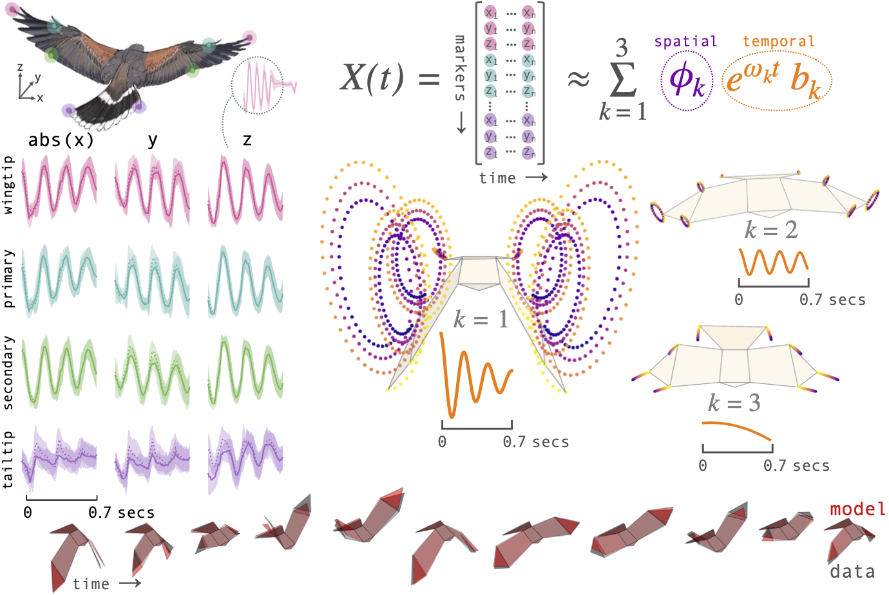

# BirdDMD

[![Actions Status][actions-badge]][actions-link]



BirdDMD is a minimal toolkit for decomposing
motion-capture time series into spatially coherent oscillatory modes.
It wraps [PyDMD](https://mathlab.github.io/PyDMD/) with sensible
defaults for biological motion data and provides hawk-specific
convenience functions built on the
[morphing_birds](https://github.com/LydiaFrance/morphing_birds) library for animation.


## Architecture

```
BirdDMD
├── core          ← run_dmd(), DMDResult, convergence analysis
├── reconstruction← reconstruct(), forecast()
├── data          ← validation, normalisation, binning, reshaping
├── stats         ← RMSE, variance explained, sequence filtering
├── plotting      ← dataset-agnostic DMD visualisation
├── hawk          ← hawk-specific loading, wrappers, and plots
└── _constants    ← named constants (marker positions, colours)
```

The package separates **dataset-agnostic** DMD utilities (`core`, `data`,
`reconstruction`, `stats`, `plotting`) from **hawk-specific** functions
(`hawk`, `_constants`), so the core analysis can be reused with other
motion-capture datasets.

## Documentation

Full documentation: **[lydiafrance.github.io/BirdDMD](https://lydiafrance.github.io/BirdDMD/)**

- [Quickstart guide](https://lydiafrance.github.io/BirdDMD/quickstart/) — installation and first analysis
- [API Reference](https://lydiafrance.github.io/BirdDMD/api/) — full module documentation
- [Notebook Gallery](https://lydiafrance.github.io/BirdDMD/notebooks/) — worked examples from the manuscript

## Notebook Gallery

| Notebook | Topic |
|----------|-------|
| [00 Introduction](notebooks/00_introduction.ipynb) | DMD theory, synthetic example, and data description |
| [01 Flapping Modes](notebooks/01_flapping_modes.ipynb) | Flapping mode decomposition |
| [03 Double Frequency](notebooks/03_double_frequency.ipynb) | The doubled-frequency mode (2&omega;) |
| [04 Full Flight](notebooks/04_full_flight.ipynb) | Full flight trajectory: flapping to gliding |
| [05 Turning](notebooks/05_turning.ipynb) | Obstacle avoidance and turning |
| [06 Reconstruction Accuracy](notebooks/06_reconstruction_accuracy.ipynb) | Batch RMSE statistics |
| [07 Generative Model](notebooks/07_generative_model.ipynb) | Forecasting, frequency modification, and synthetic flight |

## Installation

```bash
git clone https://github.com/LydiaFrance/BirdDMD
cd BirdDMD
uv sync
```

See the [Quickstart guide](https://lydiafrance.github.io/BirdDMD/quickstart/) for full installation options.

## Quick Example

```python
import numpy as np
import birddmd

# Load hawk data from an NPZ sample file
df, marker_cols = birddmd.load_bird_data("Toothless", "Flapping", perch_distance="9m")
avg_shape = birddmd.get_average_shape(n_markers=8)

# Prepare a single sequence
markers, times = birddmd.load_sequence_data(
    df,
    seqID=df["seqID"].unique()[0],
    marker_column_names=marker_cols,
)

# Normalise
markers_norm = birddmd.normalise_data(
    markers.reshape(-1, 8, 3),
    average_shape=avg_shape,
)

# Run DMD
result = birddmd.run_dmd(
    data=markers_norm,
    times=times,
    n_modes=6,
    d=2,
    eig_constraints={"conjugate_pairs"},
    average_shape=avg_shape,
    n_markers=8,
)

# Inspect the result
print(f"Eigenvalues:  {result.eigenvalues}")
print(f"Frequencies:  {result.frequencies_hz}")
print(f"Conjugate pairs: {result.conjugate_pairs}")
```

See the [Quickstart guide](https://lydiafrance.github.io/BirdDMD/quickstart/) for reconstruction, forecasting, and more.

## Contributing

See [CONTRIBUTING.md](CONTRIBUTING.md) for instructions on how to contribute.

## License

Distributed under the terms of the [MIT license](LICENSE).


<!-- prettier-ignore-start -->
[actions-badge]:            https://github.com/LydiaFrance/BirdDMD/workflows/CI/badge.svg
[actions-link]:             https://github.com/LydiaFrance/BirdDMD/actions
<!-- prettier-ignore-end -->
