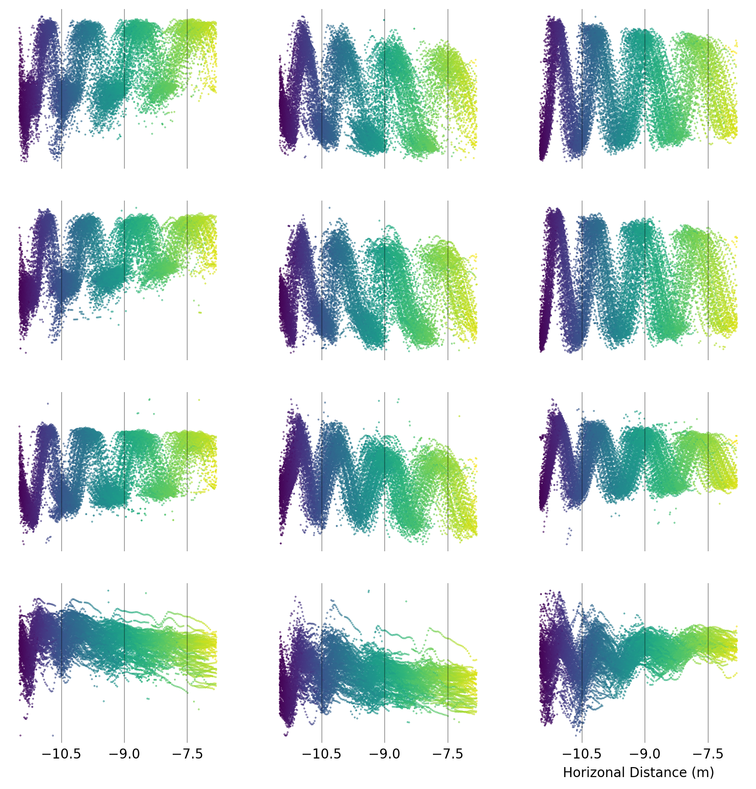
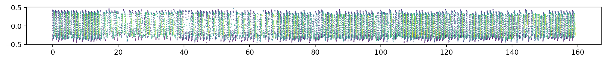
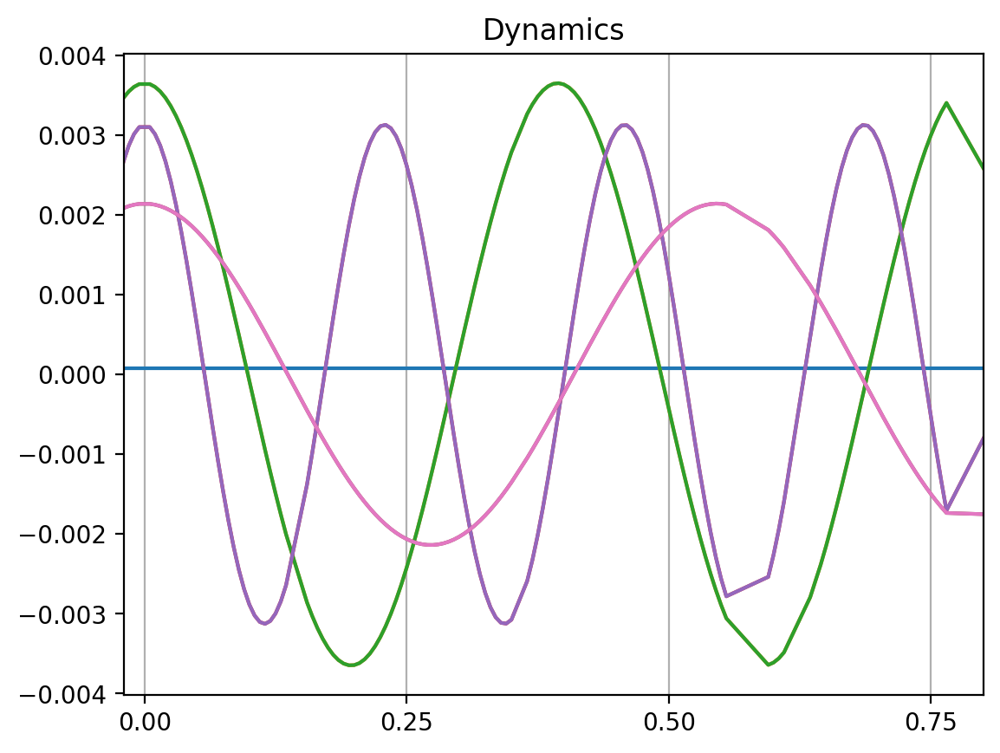
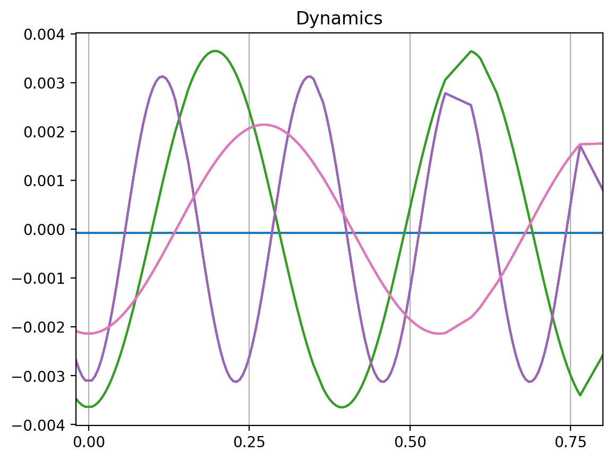
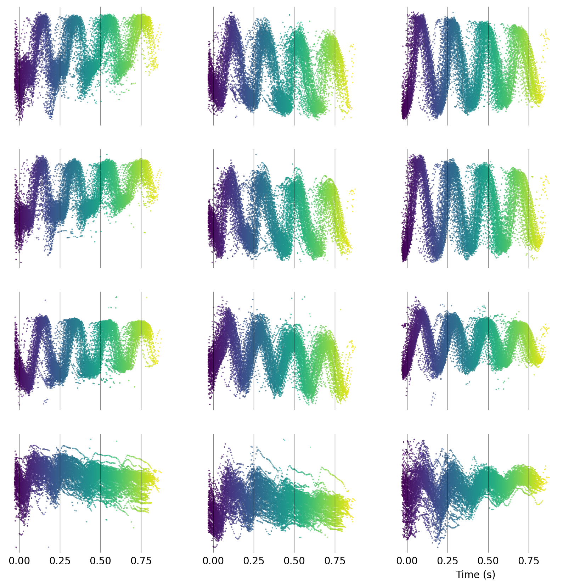
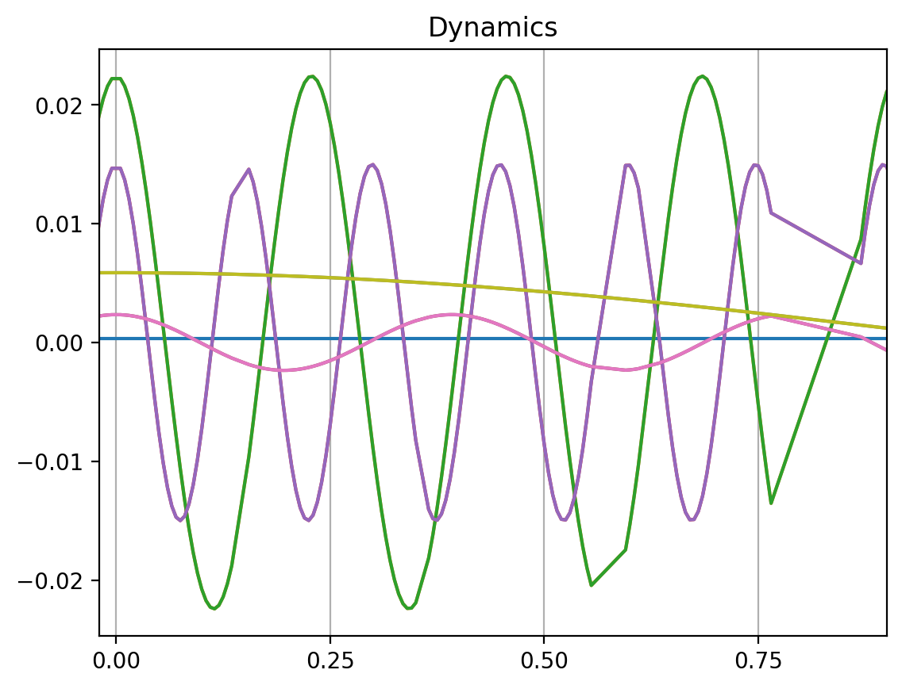

# Experiment: Four Wingbeats by One Bird

> 2024-02-20 Using 03_FlappingToothless12m.ipynb
> [Github Link to notebook code](https://github.com/LydiaFrance/BirdDMD/blob/main/src/birddmd/03_FlappingToothless12m.ipynb)

## Input Data

Toothless, an inexperienced male Harris' hawk, from 177 flights of 12m between two perches. Taking the section of flight which is flapping, which is selected as betyween 12m and 6.8m from the end perch. Approximately 4 wingbeats are present. 

Data contains `[x y z]` coordinates for four markers, relative to the central point on the bird. Markers are from the right side of the bird only, with three markers on the right wing and one on the right side of the tail. 

There were no obstacles in the flights, and no weights added to the bird. 

This constitutes the entire flapping behaviour in these flights.  

<p align="center">
    
</p>

*Figure 1: Columns show x, y, z dimensions respectively. Rows show the different markers. From top: wingtip; primary feather; secondary feather; outer tail feather tip.Markers shown over spatial distance to the landing perch.*


## Data Processing

Each data sequence lasts roughly 0.8 seconds, with around 100 frames per sequence except for major dropout.

Duplicate frames, where two instances were found in the same time stamp, were removed. This was around 9% of the total frames. 

An adjusted time was calculated such that each sequence was concatenated -- with each sequence following the last in time.




*Figure 2: Each flight sequence shown with an adjusted time variable, such that each sequence follows the previous and times do not overlap. Only right wingtip in z shown for demonstration purposes.*

## DMD Analysis

The input marker data was `12 x 17927` in size.   

The following settings were used:

```python
delay_optdmd = hankel_preprocessing(BOPDMD(svd_rank=7, num_trials=0, eig_constraints={"imag", "conjugate_pairs"}), d=2)
delay_optdmd.fit(markers, t=seqTime[1:])
plot_summary(delay_optdmd, index_modes=[0,2,4], order='F') 
```

Which produced the following plot. 

<p align="center">
    
</p>

*Figure 3: Output of the DMD Analysis. Modes 1,3,5 are shown.*

## Dynamics Plot

Using the following settings:

```python
for dynamic in delay_optdmd.dynamics:
    plt.plot(seqTime[1:], dynamic.real)
```


Just in case the sign is arbitrary as in PCA here is the same figure with the y axis unmirrored and mirrored. 

<p align="center">
     
</p>

*Figure 4: Output of the DMD Dynamics. X axis trimmed to a similar timeframe as a single wingbeat. The right panel shows the same but the y axis mirrored.*


Looking at a plot of the raw data over time with the same vertical grid lines in time:

<p align="center">
    
</p>


Just in case, I ran the DMD again with the following settings:

```python
delay_optdmd = hankel_preprocessing(BOPDMD(svd_rank=9, num_trials=0, eig_constraints={"imag", "conjugate_pairs"}), d=2)
delay_optdmd.fit(markers, t=seqTime[1:])
```

<p align="center">
    
    
</p>